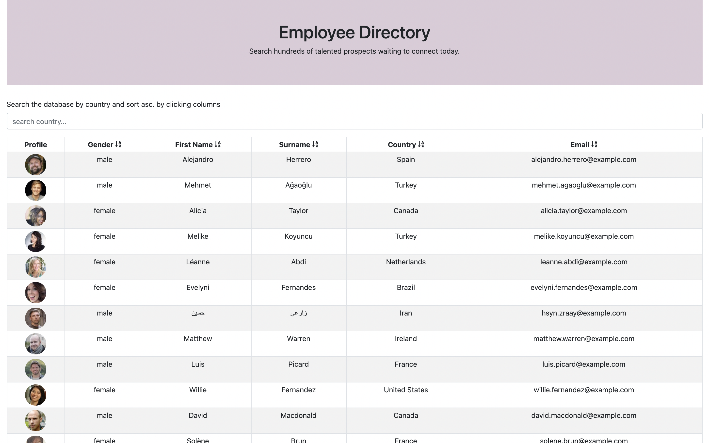

 

# Simple Employee Directory

## Description
For this project I was tasked with creating an employee directory with React, breaking the application's UI into components and manage component state, and respond to user events.

The application allows the user to search randomonly generated user data from [Random User API](https://randomuser.me/) which displays non-senstive data.

The user is also able to:
  * Sort the table by first name, surnae, email, gender or country.
  * Filter the users by country.

### User Story

> As a **user**, I want to be able to **view my entire employee directory at once** so that **I have quick access to their information**.

## Table of Contents
- [Preview](#Preview)
- [Execute](#Execute)
- [Contributing](#Contributing)
- [License](#License)
- [Environment](#Environment)
- [Questions](#Questions)
- [Resources](#Resources)

## Preview

> Visit the deployed application on [Github Pages](https://rubybassi.github.io/simple-employee-directory/).

#### Homepage

#### Demo

## Execute
Clone the repo and in the command line run `npm install` or shortcut `npm i` to download all the npm package dependancies which include: Node Express and Mongoose.

Then invoke the application with command `npm run start`.

## Contributing
Contributions are welcomed.

## License
MIT

## Environment
* [Visual Studio Code](https://code.visualstudio.com/)
* [Git](https://git-scm.com/book/en/v2/Getting-Started-Installing-Git)
* [Node.js](https://nodejs.org/en/)
* [NPM](https://www.npmjs.com/)
* [React](https://reactjs.org/)
* [React Boostrap](https://react-bootstrap.github.io/)
* [React Fontawesome](https://fontawesome.com/how-to-use/on-the-web/using-with/react)
* [React Developer Tools](https://chrome.google.com/webstore/detail/react-developer-tools/fmkadmapgofadopljbjfkapdkoienihi?hl=en)

## Resources
* [Net Stuff](http://www.dotnet-stuff.com/tutorials/html-5-tutorials/html-5-indexeddb)
* [Traversy Media](https://youtu.be/w7ejDZ8SWv8)
* [Web Dev Simplified](https://youtu.be/hQAHSlTtcmY)
* [freeCodeCamp.org](https://youtu.be/4UZrsTqkcW4)